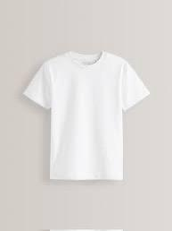
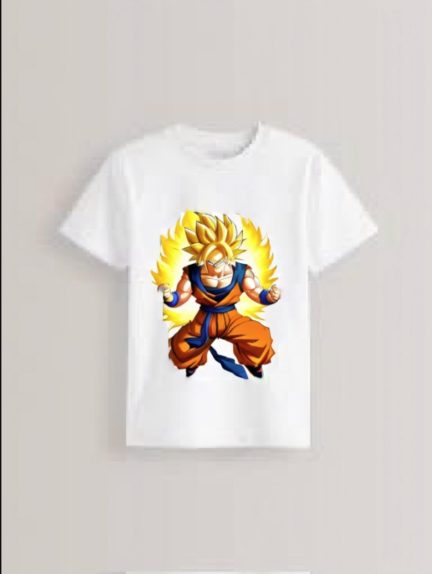
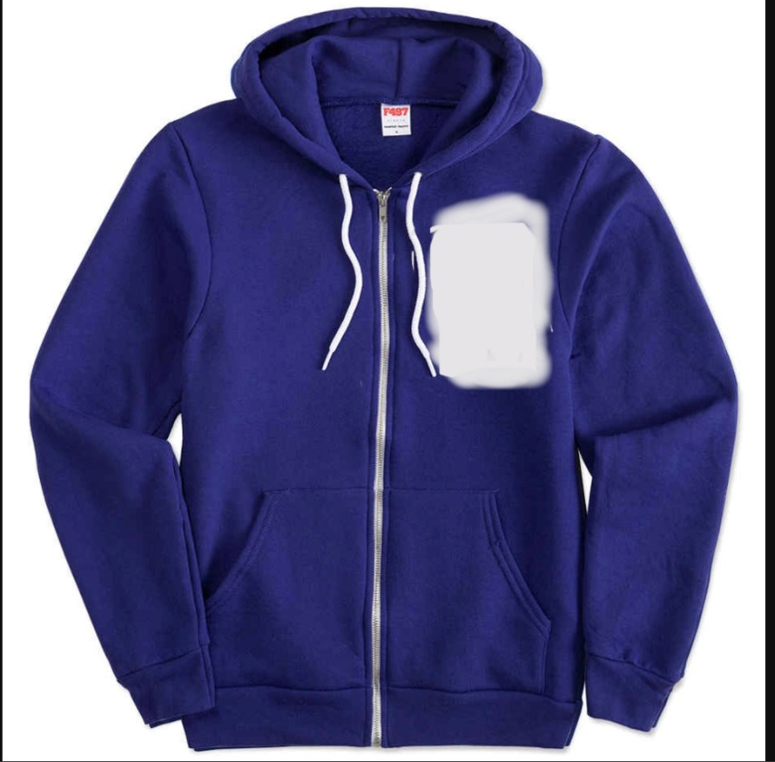
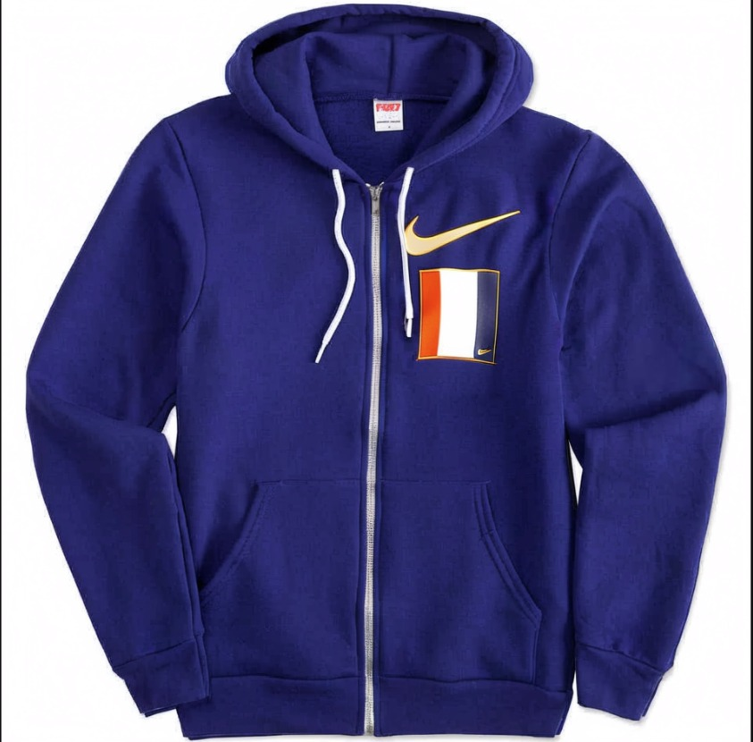

# 🎨 Custom Clothing Painting API

This project provides an API that lets users apply stunning custom artwork to their own clothing (shirts, hoodies, etc.) using advanced painting techniques powered by Stable Diffusion. Users can upload their own clothing images and masks, provide prompts, and receive transformed artistic outputs.

---

## ✨ Features

- Upload any clothing image and mask
- Customize artwork using prompts
- Powered by cutting-edge AI models
- Configurable resolution, style, and LoRA models
- Supports Stable Diffusion XL, Juggernaut, and custom LoRAs

---

## 🚀 Models Used

- **Base Checkpoints**:  
  - `Stable Diffusion XL`  
  - `Juggernaut`  
  - Custom-trained anime checkpoint

- **LoRA Models**:  
  - One LoRA for tag-based guidance  
  - One LoRA for abstract artistic style

---

## 📡 API Endpoint

### `POST /generate/`

Generate an AI-enhanced clothing design.

#### 📥 Inputs (Form Data)

| Field            | Type        | Description |
|------------------|-------------|-------------|
| `image`          | File        | Original clothing image (PNG/JPG) |
| `mask`           | File        | Mask image to guide inpainting |
| `prompt`         | string      | Your artistic vision |
| `negative_prompt`| string      | (Optional) What to avoid (default: `ugly, deformed...`) |
| `checkpoint_name`| string      | Checkpoint path (default provided) |
| `lora_name`      | string      | LoRA path (default provided) |
| `width`          | int         | Width of generated image (default: 1080) |
| `height`         | int         | Height of generated image (default: 1080) |
| `steps`          | int         | Number of inference steps (default: 30) |
| `cfg`            | float       | CFG scale (default: 9.0) |
| `sampler_name`   | string      | Sampler method (e.g., `euler_ancestral`) |
| `scheduler`      | string      | Scheduler type (default: `normal`) |
| `seed`           | int         | (Optional) Random seed for reproducibility |

#### 📤 Output

- Returns the AI-generated image as a PNG stream

---

## 🖼️ Examples

Add before/after results in this section (drag and drop or insert markdown image syntax):

| Before | After |
|--------|-------|
|  |  |
|  |  |


---

## ⚙️ Setup Instructions

Clone ComfyUI repo and Add the path to it in advance_wf.py Also the model You want to use add them in ComfyUI models directory as well 
1. **Clone this repository**

```bash
git clone https://github.com/yourusername/your-repo-name.git
cd your-repo-name
